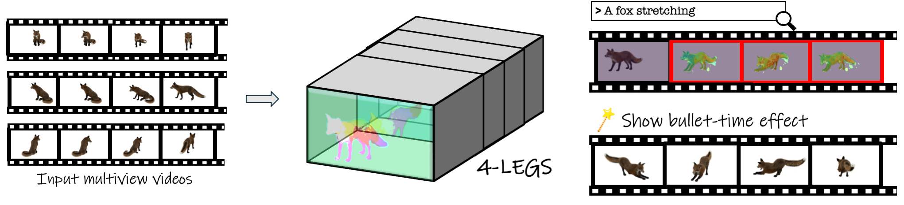

# 4-LEGS: 4D Language Embedded Gaussian Splatting
### [Project Page](https://tau-vailab.github.io/4-LEGS/) | [ArXiv](https://arxiv.org/abs/2410.10719) | [Grounding PanopticSports Benchmark](https://drive.google.com/drive/folders/1iZ1HvEUz-xQtWJY2aoXIcPhX_owVVj6b?usp=drive_link)

This is the official pytorch implementation of 4-LEGS.

> **4-LEGS: 4D Language Embedded Gaussian Splatting** 
> Gal Fiebelman1, Tamir Cohen 1, Ayellet Morgenstern 1, Peter Hedman2, Hadar Averbuch-Elor1 
> 1Tel Aviv University, 2Google Research

>**Abstract**  
> The emergence of neural representations has revolutionized our means for digitally viewing a wide range of 3D scenes, enabling the synthesis of photorealistic images rendered from novel views. Recently, several techniques have been proposed for connecting these low-level representations with the high-level semantics understanding embodied within the scene. These methods elevate the rich semantic understanding from 2D imagery to 3D representations, distilling high-dimensional spatial features onto 3D space. In our work, we are interested in connecting language with a dynamic modeling of the world. We show how to lift spatio-temporal features to a 4D representation based on 3D Gaussian Splatting. This enables an interactive interface where the user can spatiotemporally localize events in the video from text prompts. We demonstrate our system on public 3D video datasets of people and animals performing various actions.

  

 

# Getting Started

## Getting the repo
    git clone https://github.com/TAU-VAILab/4-LEGS.git
    cd 4-LEGS

## Setting up environment
    conda create --name 4legs python=3.7 --yes
    conda activate 4legs
For some python packages, `Rust` is needed, to install run the following command:

    curl https://sh.rustup.rs -sSf | sh
After installation close the current terminal session and open a new one.   
 
Now, install `pytorch`: 

    pip install torch==1.12.1+cu116 torchvision==0.13.1+cu116 torchaudio==0.12.1 --extra-index-url https://download.pytorch.org/whl/cu116

    
Install the rest of the packages using these commands:  

    pip install -r requirements.txt
    cd diff-gaussian-rasterization-w-depth	
    python setup.py install
    pip install .
    cd ../diff-gaussian-rasterization-w-depth-feat/
    python setup.py install
    pip install .
    cd ../

# 4-LEGS Training

## Getting the Data
To get the `PanopticSports` dataset, run these commands:

    wget https://omnomnom.vision.rwth-aachen.de/data/Dynamic3DGaussians/data.zip
    unzip data.zip
    rm data.zip
Now the data should be under the folder `data/`.

## Pretraining a Dynamic 3DGS
First, we need to pretrain a `Dynamic 3DGS`:

    python train_d3dgs.py -s <data sequence folder name> -e <experiment name>

For example:

    python train_d3dgs.py -s basketball -e pretrained

For this example, the output model is under `output/pretrained/basketball/`.

In order to render the pretrained `Dynamic 3DGS`:

    python visualize_d3dgs.py -s <data sequence folder name> -e <experiment name>

For example:

    python visualize_d3dgs.py -s basketball -e pretrained

For this example, the output video is under `results/pretrained/basketball/`.

## Extracting Features
In order to train our `4-LEGS`, first we have to extract spatio-temporal features. In order to do so, first download the `ViCLIP` model. To do so, first agree to the conditions [here](https://huggingface.co/OpenGVLab/ViCLIP), download the following files: `bpe_simple_vocab_16e6.txt.gz` and `ViClip-InternVid-10M-FLT.pth` and put them under the `feature_extraction/ViCLIP/` directory.  

Now, run the following command:

    python extract_features.py -s <data sequence folder name> -f <first timestep to extract features> -l <last timestep to extract features>

For example:

    python extract_features.py -s basketball -f 0 -l 300

For this example the extracted features are under `data/basketball/interpolators/`.

(Feature extraction takes some time to run, we recommend running in parallel on multiple gpus by splitting the timesteps, if possible. (e.g., -f 0 -l 10, -f 10 -l 20, etc.))

## Training an Autoencoder
The next step is training an autoencoder:

    python train_autoencoder.py -s <data sequence folder name>

For example:

    python train_autoencoder.py -s basketball

For this example the autoencoder weights will be saved under `data/basketball/ae/`.

## Train 4-LEGS
Finally, we can train our `4-LEGS`:

    python train_4legs.py -s  <data sequence folder name> -e <experiment name> -f <first timestep to train> -l <last timestep to train>

For example:

    python train_4legs.py -s basketball -e 4legs -f 0 -l 300

For this example, the output model is under `output/4legs/basketball/`.

(Training takes some time to run, we recommend running in parallel on multiple gpus by splitting the timesteps, if possible. (e.g., -f 0 -l 10, -f 10 -l 20, etc.))

In order to render a given text prompt:

    python visualize_4legs.py -s <data sequence folder name> -e <experiment name> -p <prompt>

For example:

    python visualize_4legs.py -s basketball -e 4legs -p "A ball flying in air"

For this example, the output video is under `results/4legs/basketball/A_ball_flying_in_air/`.

## Notes on license
The code in this repository (except `external.py`, the rasterization directories `diff-gaussian-rasterization-w-depth/` and `diff-gaussian-rasterization-w-depth-feat/` and the ViCLIP directory `feature_extraction/ViCLIP`) is licensed under the MIT licence.

This code runs using code adapted from [here](https://github.com/JonathonLuiten/diff-gaussian-rasterization-w-depth), [here](https://github.com/graphdeco-inria/gaussian-splatting) and [here](https://github.com/OpenGVLab/InternVideo/tree/main/Data/InternVid).
These are required for this project, and for these a more restrictive license from Inria applies which can be found [here](https://github.com/graphdeco-inria/gaussian-splatting/blob/main/LICENSE.md) and an Apache license that can be found [here](https://github.com/OpenGVLab/InternVideo/blob/main/LICENSE).
This requires different permissions for use in any commercial application, but is otherwise freely distributed for research and experimentation.

# Grounding PanopticSports Benchmark

See [Grounding PanopticSports Benchmark documentation](docs/benchmark.md) for more information on the Grounding PanopticSports Benchmark.
 

# BibTeX
If you find our work useful in your research, please consider citing:

     @misc{fiebelman20244legs4dlanguageembedded, 
      title={4-LEGS: 4D Language Embedded Gaussian Splatting},
      author={Gal Fiebelman and Tamir Cohen and Ayellet Morgenstern and Peter Hedman and Hadar Averbuch-Elor},
      year={2024},
      eprint={2410.10719},
      archivePrefix={arXiv},
      primaryClass={cs.CV}
    }
    
 

# Acknowledgements

We thank the authors of [Dynamic 3D Gaussians](https://github.com/JonathonLuiten/Dynamic3DGaussians/tree/main) for their wonderful code on which we base our own.